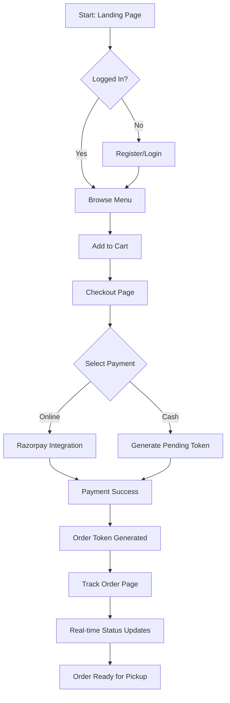
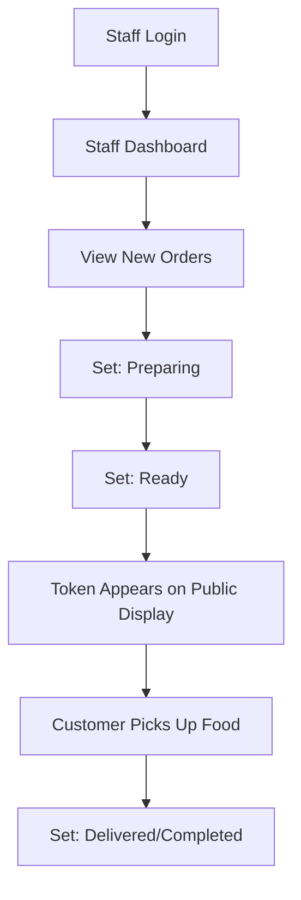
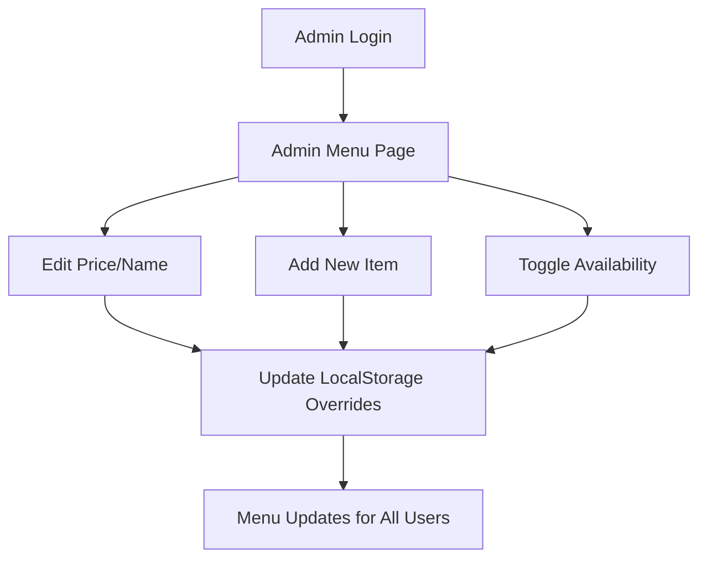

# Canteen Grab & Go: System Workflow Documentation

This document outlines the workflow, system architecture, and database schema for the **Canteen Grab & Go** project. It is designed to help developers, staff, and administrators understand how the platform operates.

---

## 🏗️ System Overview

**Canteen Grab & Go** is a smart canteen ordering and token management system that facilitates seamless food ordering for students and efficient order processing for canteen staff.

### 👥 User Roles
1.  **Student/Customer**: Browses the menu, places orders, makes payments, and tracks order status.
2.  **Staff**: Monitors incoming orders via a dashboard and updates their status as they are prepared and ready.
3.  **Administrator**: Manages the menu items, categories, and system-wide settings.
4.  **Public Display**: A screen that shows currently "Ready" tokens for student pickup.

---

## 🔄 Core Workflows

### 1. Student Ordering Journey
The student journey begins at the landing page and ends with receiving their food.

### 2. Staff Operation Workflow
Staff members use a dedicated dashboard to manage the kitchen queue.

### 3. Administrative Functions
Admins can modify the menu in real-time without database migrations.

---

## 🗄️ Database Schema (Supabase)

The system uses **Supabase** (Postgres) for real-time data management.

### `profiles` Table
Stores user roles and base information.
*   `id` (UUID, PK): Authenticated User ID.
*   `full_name` (Text): Name provided during registration.
*   `role` (Text): 'user', 'staff', 'admin'.

### `orders` Table
The central registry for all transactions.
| Column | Type | Description |
| :--- | :--- | :--- |
| `id` | UUID | Primary Key |
| `token` | Text | Human-readable token (e.g., "R-101") |
| `user_id` | UUID | Reference to `profiles.id` |
| `status` | Text | `pending`, `preparing`, `ready`, `completed`, `cancelled` |
| `total` | Numeric | Total cost of the order |
| `order_type` | Text | `dine-in`, `take-away`, `staff-delivery` |
| `payment_method` | Text | `razorpay`, `cash` |
| `payment_status` | Text | `pending`, `paid`, `failed` |

### `order_items` Table
Line items for each order.
*   `order_id` (UUID, FK): Links to `orders.id`.
*   `menu_item_id` (Text): References the food item.
*   `name` (Text): Food item name.
*   `price` (Numeric): Unit price.
*   `quantity` (Integer): Number ordered.

---

## 🛠️ Technology Stack
- **Frontend**: Vite (React + TypeScript)
- **Styling**: Tailwind CSS + Shadcn UI
- **Database/Auth**: Supabase
- **Payments**: Razorpay API
- **State Management**: React Query + LocalStorage (for Menu Overrides)
